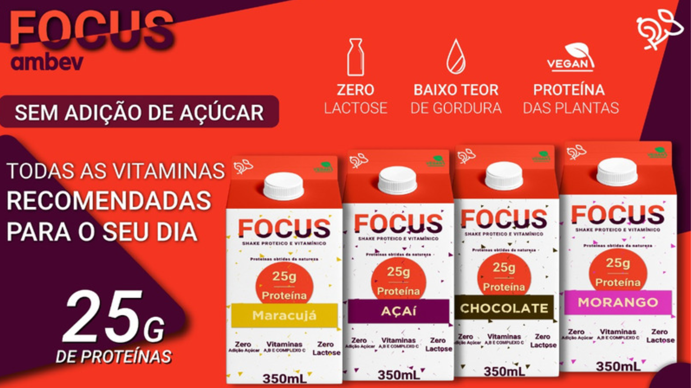

Innovation Game 2 - Desafio Criar um Novo PRODUTO não-alcóolico para a AMBEV

Infomercial do Projeto: https://www.youtube.com/watch?v=t56F3-j8l30

Pitch do Hackathon: https://www.youtube.com/watch?v=BVfG2l7oWNw

Projeto com FRONT END em REACT para aprender a usar STYLED-COMPONENTS e Carrosel 
Carrosel com react-slick

STYLED-COMPONENTS para CSS dentro do JSX (Facilita bastante ter um CSS programático)

CUSTOM HOOKs para Formulários (Criado para facilitar limpar, alterar...)

Back-end em JSON Server com deploy no HEROKU (GET Categorias e GET videos)

Front-end na VERCEL (now.sh) em: https://innovationgamemvp.vercel.app/

404 Custom com Flappy Birds :  https://innovationgamemvp.vercel.app/erro

Agosto 2020

